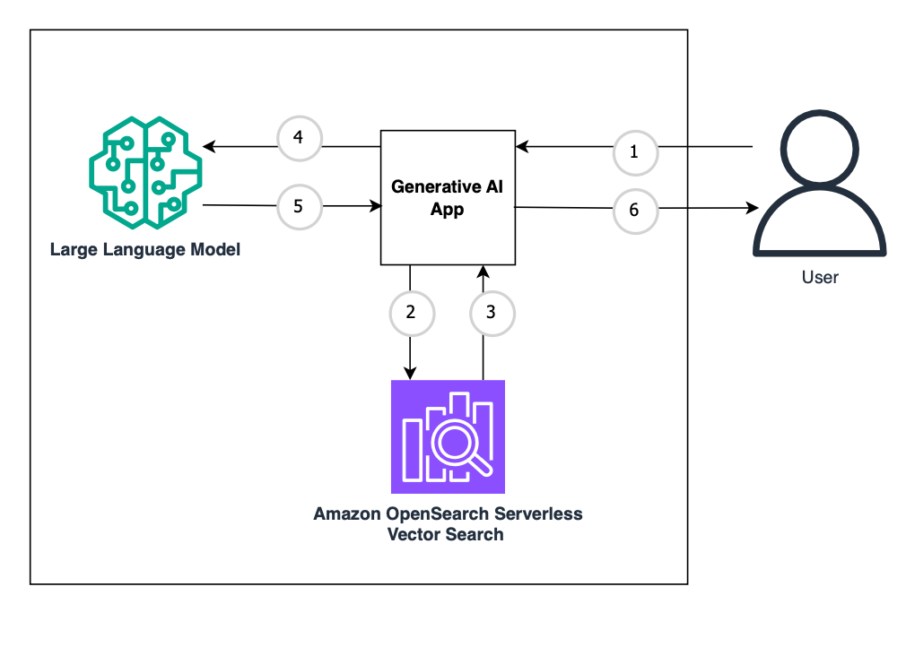

# Amazon-Bedrock-RAG-OpenSearchServerless-POC
This is sample code demonstrating the use of Amazon Bedrock and Generative AI to create custom embeddings stored in Amazon OpenSearch Serverless. The application is constructed with a RAG based architecture where users can ask questions against the indexed embeddings within OpenSearch Serverless.

# **Goal of this Repo:**
The goal of this repo is to provide users the ability to use Amazon Bedrock and generative AI to take natural language questions, and answer questions against embedded and indexed documents in Amazon OpenSearch Serverless Vector Search.
This repo comes with a basic frontend to help users stand up a proof of concept in just a few minutes.

The architecture and flow of the sample application will be:

When a user interacts with the GenAI app, the flow is as follows:

1. The user makes a request to the GenAI app (app.py).
2. The app issues a k-nearest-neighbors search query to the Amazon OpenSearch Serverless Vector Search index based on the user request. (query_against_opensearch.py)
3. The index returns search results with excerpts of relevant documents from the ingested data. (query_against_opensearch.py)
4. The app sends the user request and along with the data retrieved from the Amazon OpenSearch Serverless Vector Search index as context in the LLM prompt. (query_against_opensearch.py)
5. The LLM returns a succinct response to the user request based on the retrieved data. (query_against_opensearch.py)
6. The response from the LLM is sent back to the user. (app.py)

# How to use this Repo:

## Prerequisites:
1. Amazon Bedrock Access and CLI Credentials.
2. Appropriate permissions to configure Amazon OpenSearch Serverless Vector Search.