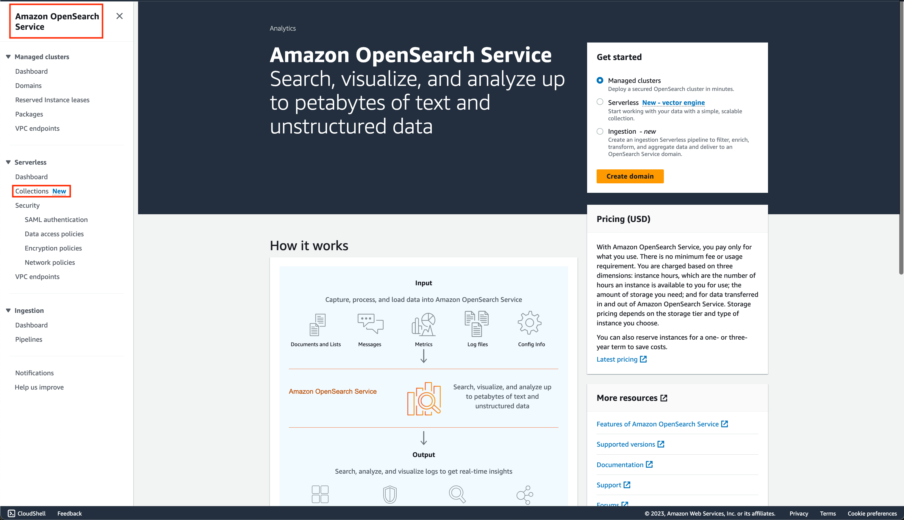
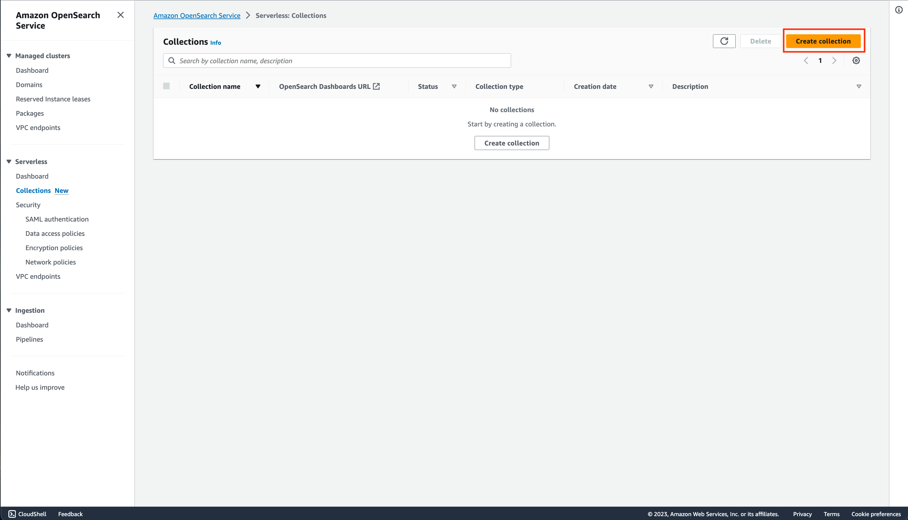
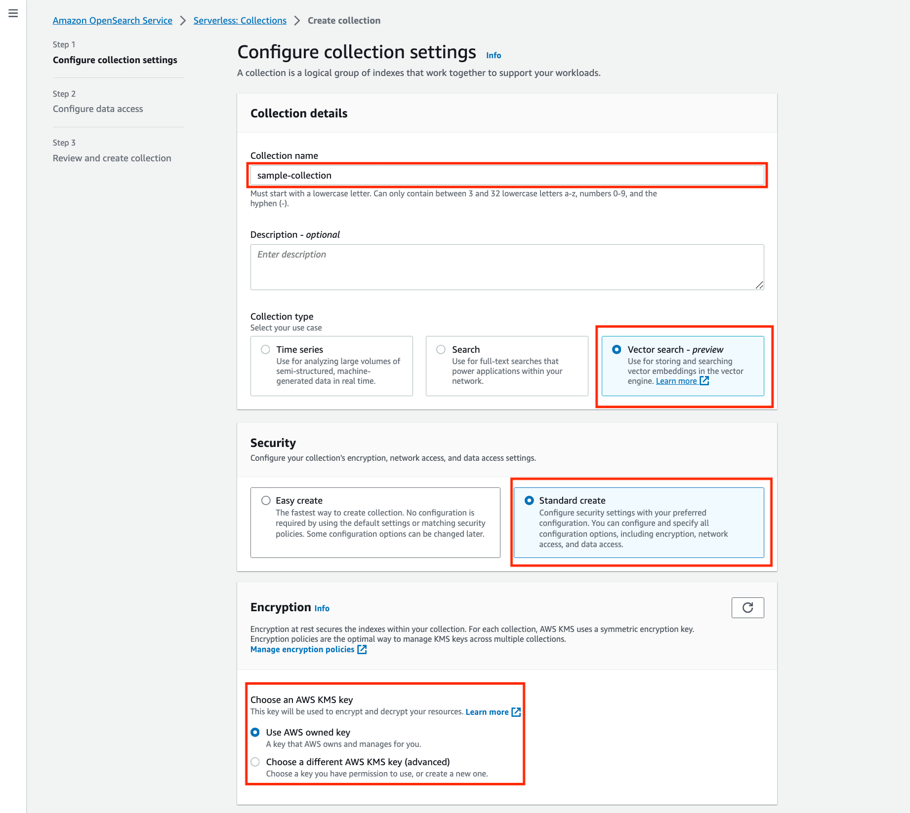
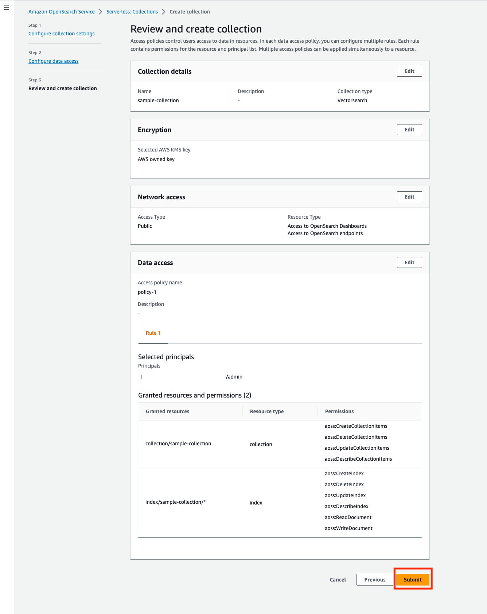
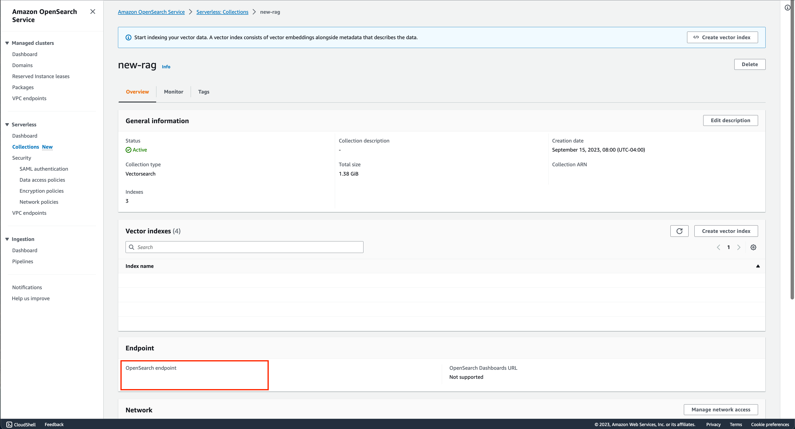
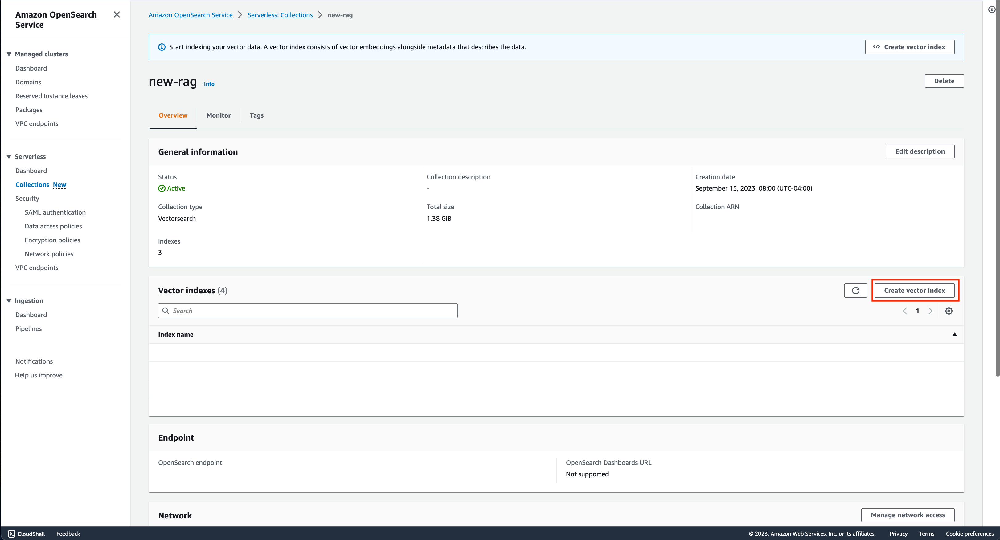
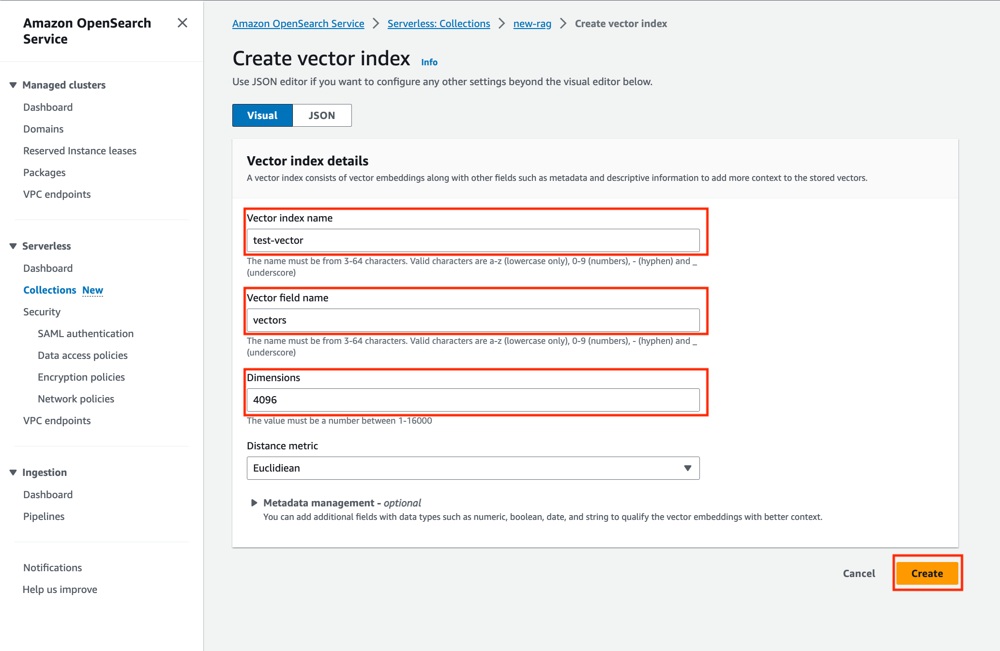
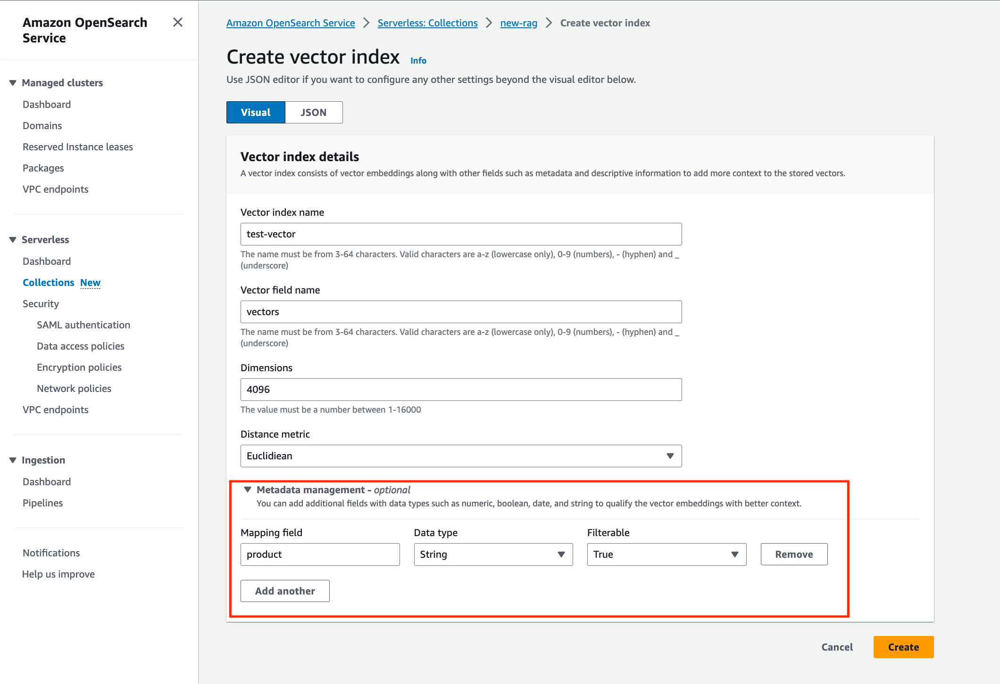

# Amazon-Bedrock-RAG-OpenSearchServerless-POC
This is sample code demonstrating the use of Amazon Bedrock and Generative AI to create custom embeddings stored in Amazon OpenSearch Serverless with the ability ask questions against the stored documents. The application is constructed with a RAG based architecture where users can ask questions against the indexed embeddings within OpenSearch Serverless.

# **Goal of this Repo:**
The goal of this repo is to provide users the ability to use Amazon Bedrock and generative AI to take natural language questions, and answer questions against embedded and indexed documents in Amazon OpenSearch Serverless Vector Search.
This repo comes with a basic frontend to help users stand up a proof of concept in just a few minutes.

The architecture and flow of the sample application will be:


When a user interacts with the GenAI app, the flow is as follows:

1. The user makes a request to the GenAI app (app.py).
2. The app issues a k-nearest-neighbors search query to the Amazon OpenSearch Serverless Vector Search index based on the user request. (query_against_opensearch.py)
3. The index returns search results with excerpts of relevant documents from the ingested data. (query_against_opensearch.py)
4. The app sends the user request and along with the data retrieved from the Amazon OpenSearch Serverless Vector Search index as context in the LLM prompt. (query_against_opensearch.py)
5. The LLM returns a succinct response to the user request based on the retrieved data. (query_against_opensearch.py)
6. The response from the LLM is sent back to the user. (app.py)

# How to use this Repo:

## Prerequisites:
1. Amazon Bedrock Access and CLI Credentials.
2. Appropriate permissions to configure Amazon OpenSearch Serverless Vector Search.
3. Ensure Python 3.9 installed on your machine, it is the most stable version of Python for the packages we will be using, it can be downloaded [here](https://www.python.org/downloads/release/python-3911/).

## Step 1:
The first step of utilizing this repo is performing a git clone of the repository.

```
git clone https://github.com/aws-rdoty/Amazon-Bedrock-RAG-OpenSearchServerless-POC.git
```

After cloning the repo onto your local machine, open it up in your favorite code editor.The file structure of this repo is broken into 4 key files,
the app.py file, the docs_to_openSearch.py file, the query_against_openSearch.py file and the requirements.txt. 
The app.py file houses the frontend application (a streamlit app).
The docs_to_openSearch.py file houses the logic needed to take a PDF document stored on your local machine, creating the embeddings and storing it in your OpenSearch Index. 
The query_against_openSearch.py file houses the logic for taking a user question and letting the LLM generate a response, this includes both the OpenSearch Query API calls and Amazon Bedrock API invocation.
The requirements.txt file contains all necessary dependencies for this sample application to work.

## Step 2:
Set up a python virtual environment in the root directory of the repository and ensure that you are using Python 3.9. This can be done by running the following commands:
```
pip install virtualenv
python3.9 -m venv venv
```
The virtual environment will be extremely useful when you begin installing the requirements. If you need more clarification on the creation of the virtual environment please refer to this [blog](https://www.freecodecamp.org/news/how-to-setup-virtual-environments-in-python/).
After the virtual environment is created, ensure that it is activated, following the activation steps of the virtual environment tool you are using. Likely:
```
cd venv
cd bin
source activate
cd ../../ 
```
After your virtual environment has been created and activated, you can install all the requirements found in the requirements.txt file by running this command in the root of this repos directory in your terminal:
```
pip install -r requirements.txt
```
## Step 3:
Now that we have successfully cloned the repo, created and activated the virtual environment and installed the necessary dependencies, it is time for us to create our Amazon OpenSearch Serverless
Vector Search collection.

To create our Amazon OpenSearch Vector Search Collection we will:
1. Go to the Amazon OpenSearch Service homepage within the AWS console and on the left-hand side we will select "Collections" under the "Serverless" drop down 
2. We will then click on "Create collection" 
3. On the "Configure collection settings" page, we will need to input a "Collection name", select the "Collection type": "Vector search", in the "Security" section select the option "Standard create", and select your preferred "Encryption" settings: 
4. On the same "Configure collection settings" page, at the bottom we will select our "Network access settings" either "Public" or "VPC", and give access to the OpenSearch Endpoint and/or OpenSearch Dashboards and select next 
5. On the "Configure data access" page we must input a "Rule name", add the user for which you have CLI credentials for, and for the sake of the POC Grant all permissions and select Next 
6. We will then enter an access policy name and select Next 
7. We will confirm all of our configuration items, and press Submit 
8. As soon as the collection is created, you will want to **BE SURE TO NOTE DOWN THE OPENSEARCH ENDPOINT** 

## Step 4:
With our Amazon OpenSearch Serverless Vector Search collection created, we now must create our Vector Index. As soon as this is created we will begin indexing our PDF document.

1. Within the OpenSearch Serverless Collection we just created, we will select "Create vector index" 
2. We will then input a Vector Index Name, Vector Field Name, Dimensions and distance metric... **BE SURE TO NOTE DOWN THE VECTOR INDEX NAME AND VECTOR FIELD NAME**. The Dimensions field is expecting an integer, in our case since we are using the 'amazon.titan-e1t-medium' embeddings model, the dimension size will be 4096. If you plan on using a different embeddings model you will need to change this value to represent the output vector size of that specific model. Then Select "Create" 
3. ***OPTIONAL:*** If you want to add meta-data to your documents that you plan on indexing, you must specify those fields in this vector index configuration. If you plan on adding meta-data you will need to reconfigure some of the code in the docs_to_openSearch.py file 

## Step 5:
Now that the requirements have been successfully installed in your virtual environment, your OpenSearch Serverless Vector Search and Vector Index are created, we can now begin configuring environment variables.
You will first need to create a .env file in the root of this repo. Within the .env file you just created you will need to configure the .env to contain:

```
profile_name=<AWS_CLI_PROFILE_NAME>
opensearch_host=<AMAZON_OPENSEARCH_HOST> example->abcdefghijklmnop1234.us-east-1.aoss.amazonaws.com
vector_index_name=<vector_index_name>
vector_field_name=<vector_field_name>
```
Please ensure that your AWS CLI Profile has access to Amazon Bedrock!

## Step 6:
After you create your .env file, it is time to create the embeddings for a sample PDF document of your choosing.
All you will need to do, is specify the path to that PDF document in line 42 of the docs_to_openSearch.py file.
Optionally you can also try different values for the document chunk size in line 47 - line 51 of the same docs_to_openSearch.py file.
As soon as you are satisfied with the configuration, you can simply run the file while in the root of the repo with the command:

```
python3 docs_to_openSearch.py
```

***Depending on the size of your document this process can range from seconds to hours***

## Step 7:
As soon as you have successfully indexed your newly created embeddings within your
Amazon OpenSearch Serverless Vector Search Index, your application should be ready to go. 
To start up the application with its basic frontend you simply need to run the following command in your terminal while in the root of the repositories' directory:

```
streamlit run app.py
```
As soon as the application is up and running in your browser of choice you can begin asking natural language questions against the custom embeddings of the PDF document you created earlier and stored within your Amazon OpenSearch Serverless Vector Store Index. 

## ***The contents of this repository represent my viewpoints and not of my past or current employers, including Amazon Web Services (AWS). All third-party libraries, modules, plugins, and SDKs are the property of their respective owners.***